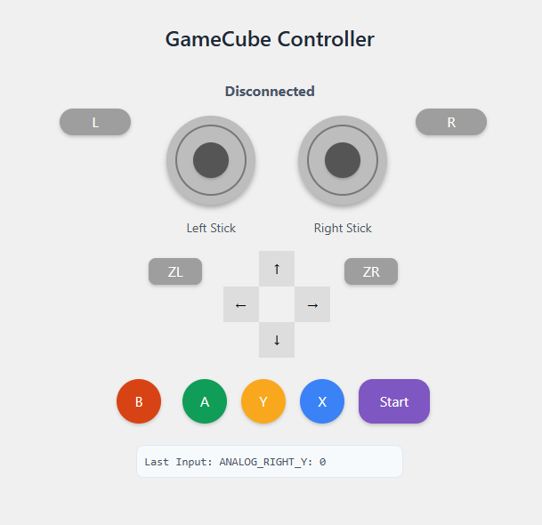

# gc-controller-web
Control games with an emulated gamecube-ish style controller, from your browser! Use a phone on the couch to talk to the input server, and game away.

# To setup and run the project:
## To make a python venv
python3 -m venv .venv

## Start venv
source .venv/bin/activate

## Install deps
pip install -r requirements.txt

## To run
python server.py

## Leave venv
deactivate
